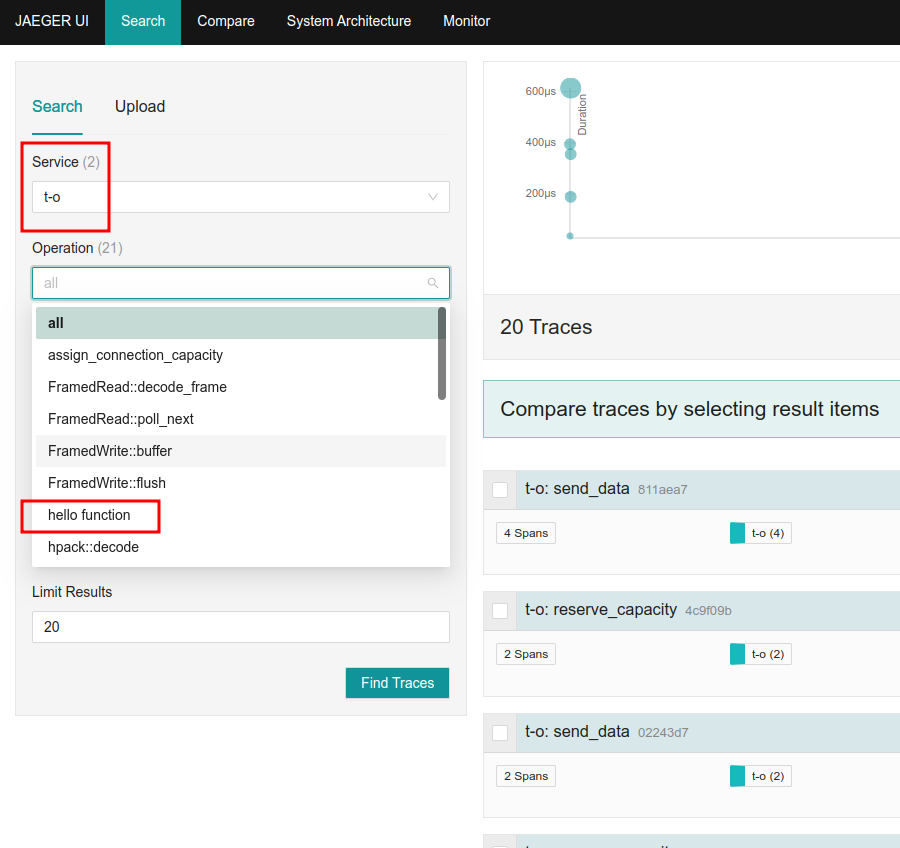

# t-o

Tracing and OTEL


```shell
podman compose -f podman-compose.yaml up
```

```shell
cargo run
```


```shell
curl localhost:8080
```

Go to [http://localhost:16686](http://localhost:16686)



